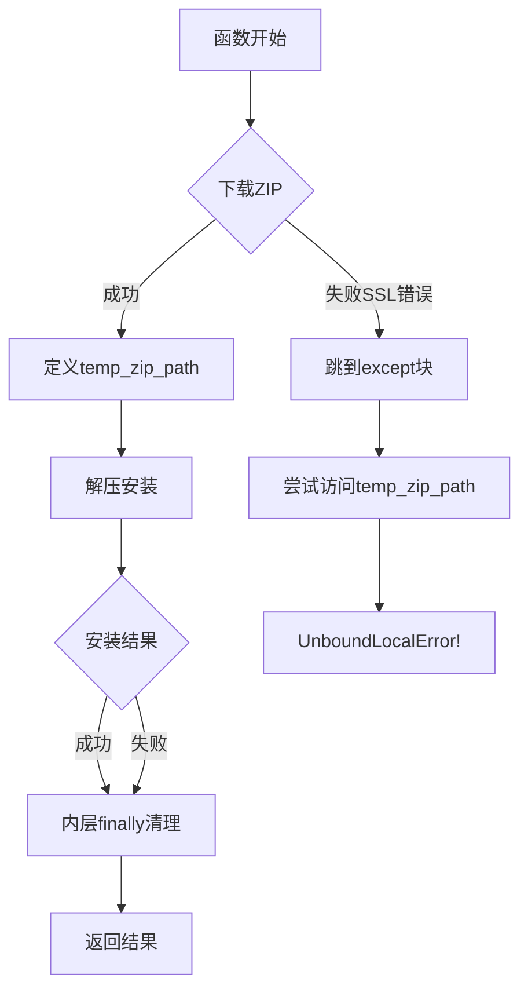
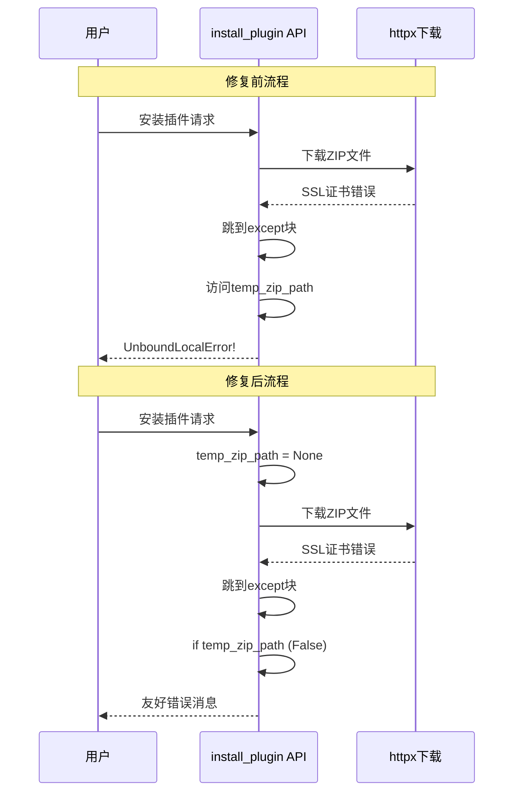

# 插件市场安装功能变量作用域错误修复方案

## 问题描述

### 错误信息
```
UnboundLocalError: cannot access local variable 'temp_zip_path' where it is not associated with a value
```

### 错误位置
- 文件: `MoFox-Core-Webui/backend/routers/marketplace_router.py`
- 函数: `install_plugin()` (第224-391行)
- 错误行: 第390行

### 错误场景
当插件下载过程中发生异常(如SSL证书验证失败)时,代码执行流程如下:

1. 第249行: `httpx.AsyncClient().get()` 抛出异常(如SSLError)
2. 跳过第253-255行的临时文件创建代码
3. 直接进入第387行的 `except` 块
4. 执行第390行的清理代码: `Path(temp_zip_path).unlink(missing_ok=True)`
5. **问题**: `temp_zip_path` 从未被定义,触发 `UnboundLocalError`

## 根本原因分析

### 代码结构问题

```python
# 当前代码结构 (有问题)
try:
    # ... 下载逻辑 (第248-250行)
    async with httpx.AsyncClient() as client:
        response = await client.get(zip_url, ...)  # 可能抛出异常
        
    # 临时文件创建 (第253-255行)
    with tempfile.NamedTemporaryFile(...) as temp_file:
        temp_file.write(response.content)
        temp_zip_path = temp_file.name  # ← 仅在下载成功后定义
        
    try:
        # ... 解压和安装逻辑
    finally:
        # 清理临时文件 (第385行)
        Path(temp_zip_path).unlink(missing_ok=True)  # ← 内层finally

except Exception as e:
    logger.error(f"安装插件失败: {e}")
    # 清理临时文件 (第390行)
    Path(temp_zip_path).unlink(missing_ok=True)  # ← 外层异常处理,temp_zip_path可能未定义
    return InstallPluginResponse(success=False, ...)
```

### 变量作用域分析



## 修复方案

### 方案概述
将 `temp_zip_path` 初始化移到 `try` 块外部,确保在任何异常路径都能安全访问。

### 修改内容

#### 修改1: 变量初始化 (第246行前)
```python
# 在try块之前添加初始化
temp_zip_path = None

try:
    # 确保插件目录存在
    PLUGINS_DIR.mkdir(parents=True, exist_ok=True)
    # ... 其余代码
```

#### 修改2: 内层清理代码 (第385行)
```python
finally:
    # 清理临时文件 (添加存在性检查)
    if temp_zip_path:
        Path(temp_zip_path).unlink(missing_ok=True)
```

#### 修改3: 外层清理代码 (第390行)
```python
except Exception as e:
    logger.error(f"安装插件失败: {e}")
    # 清理临时文件 (添加存在性检查)
    if temp_zip_path:
        Path(temp_zip_path).unlink(missing_ok=True)
    return InstallPluginResponse(success=False, message=f"安装插件失败: {e!s}")
```

### 完整修改后的代码结构

```python
@self.router.post("/install", response_model=InstallPluginResponse)
async def install_plugin(request: InstallPluginRequest, _= VerifiedDep):
    """安装插件(下载 ZIP 并解压)"""
    
    # ✅ 修改1: 在外部初始化
    temp_zip_path = None
    
    try:
        # 从仓库 URL 提取仓库名作为插件文件夹名
        repo_url = request.repository_url
        repo_name = repo_url.rstrip("/").split("/")[-1]
        target_plugin_path = PLUGINS_DIR / repo_name

        # ... 检查已安装逻辑 ...

        # 确保插件目录存在
        PLUGINS_DIR.mkdir(parents=True, exist_ok=True)

        # 下载 ZIP 文件
        zip_url = f"{repo_url}/archive/refs/heads/main.zip"
        logger.info(f"正在下载插件: {zip_url}")

        async with httpx.AsyncClient() as client:
            response = await client.get(zip_url, timeout=30.0, follow_redirects=True)
            response.raise_for_status()

            # 保存到临时文件
            with tempfile.NamedTemporaryFile(suffix=".zip", delete=False) as temp_file:
                temp_file.write(response.content)
                temp_zip_path = temp_file.name

        try:
            # ... 解压和安装逻辑 ...
            
        finally:
            # ✅ 修改2: 添加存在性检查
            if temp_zip_path:
                Path(temp_zip_path).unlink(missing_ok=True)

    except Exception as e:
        logger.error(f"安装插件失败: {e}")
        # ✅ 修改3: 添加存在性检查
        if temp_zip_path:
            Path(temp_zip_path).unlink(missing_ok=True)
        return InstallPluginResponse(success=False, message=f"安装插件失败: {e!s}")
```

## 修复效果

### 修复前
- SSL错误 → 未定义 `temp_zip_path` → `UnboundLocalError` → 用户看到内部错误

### 修复后
- SSL错误 → `temp_zip_path = None` → 跳过清理 → 返回友好错误消息

### 错误流程对比



## 测试验证

### 测试场景

1. **正常安装流程**
   - 下载成功 → 安装成功 → 临时文件正确清理
   
2. **下载阶段失败**
   - SSL错误 → 返回错误消息 → 不会触发UnboundLocalError
   - 网络超时 → 返回错误消息 → 不会触发UnboundLocalError
   
3. **解压阶段失败**
   - ZIP损坏 → 返回错误消息 → 临时文件正确清理
   
4. **安装阶段失败**
   - 权限错误 → 返回错误消息 → 临时文件正确清理

### 测试方法

```python
# 模拟SSL错误测试
import httpx
from unittest.mock import patch

@patch('httpx.AsyncClient.get')
async def test_ssl_error(mock_get):
    mock_get.side_effect = httpx.ConnectError("SSL错误")
    
    result = await install_plugin(
        InstallPluginRequest(
            plugin_id="test",
            repository_url="https://github.com/test/repo"
        )
    )
    
    assert result.success == False
    assert "SSL" in result.message or "安装插件失败" in result.message
    # 关键: 不应该抛出UnboundLocalError
```

## 注意事项

### 1. SSL证书问题仍需单独处理
本修复仅解决了变量作用域问题,SSL证书验证失败的根本原因(缺少根证书)需要另行解决:

**临时方案 (仅开发环境)**:
```python
# 方法1: 禁用SSL验证(不推荐生产环境)
async with httpx.AsyncClient(verify=False) as client:
    ...

# 方法2: 使用certifi提供证书
import certifi
async with httpx.AsyncClient(verify=certifi.where()) as client:
    ...
```

**生产方案**:
- 安装系统级根证书
- 使用 `pip install certifi` 并配置
- 配置代理服务器处理SSL

### 2. 资源清理保证
修复后保证了在任何异常情况下:
- ✅ 不会因访问未定义变量而崩溃
- ✅ 如果临时文件已创建,会正确清理
- ✅ 如果临时文件未创建,不会尝试清理

### 3. 向后兼容性
此修复不会影响现有功能,完全向后兼容。

## 相关问题

### 相同模式的潜在问题
检查代码库中是否有其他类似的变量作用域问题:

```bash
# 搜索类似模式
grep -n "NamedTemporaryFile" MoFox-Core-Webui/backend/routers/*.py
grep -n "temp_.*_path" MoFox-Core-Webui/backend/routers/*.py
```

## 实施计划

1. ✅ **分析问题** - 理解错误根因
2. ✅ **设计方案** - 确定修复策略
3. 📝 **编写文档** - 当前文档
4. ⏳ **代码实施** - 应用修复代码
5. ⏳ **测试验证** - 验证各种场景
6. ⏳ **代码审查** - 确保质量
7. ⏳ **部署上线** - 发布修复

## 参考资料

- Python作用域规则: https://docs.python.org/3/tutorial/classes.html#scopes-and-namespaces
- try-finally语句: https://docs.python.org/3/tutorial/errors.html#defining-clean-up-actions
- httpx异常处理: https://www.python-httpx.org/exceptions/

---

**文档版本**: 1.0  
**创建日期**: 2026-01-10  
**作者**: Architect Mode  
**状态**: 待实施