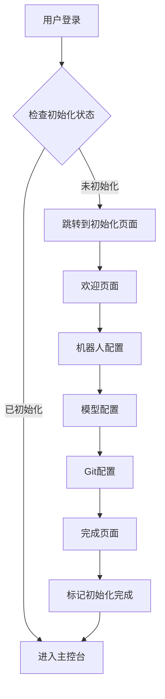

# MoFox WebUI 初始化系统 - 实现完成

> **实现日期**: 2025年12月27日  
> **状态**: ✅ 核心功能已完成

---

## 📦 已实现的功能

### 后端 (Backend)

#### 1. 初始化路由组件
**文件**: `backend/routers/initialization_router.py`

- ✅ `/status` - 获取初始化状态
- ✅ `/bot-config` - 保存机器人配置
- ✅ `/model-config` - 保存模型配置
- ✅ `/git-config` - 保存Git配置
- ✅ `/complete` - 完成初始化标记
- ✅ `/validate-api-key` - 验证API密钥
- ✅ `/detect-git` - 自动检测Git路径

#### 2. 配置管理功能
- ✅ 自动备份配置文件
- ✅ 使用 tomlkit 保留注释
- ✅ 智能合并配置（不覆盖已有配置）
- ✅ 初始化标记文件 (`.initialized`)

---

### 前端 (Frontend)

#### 1. 主初始化容器
**文件**: `forward/mofox-webui/src/views/InitializationView.vue`

- ✅ Material Design 3 风格
- ✅ 进度指示器（3步骤）
- ✅ 页面切换动画
- ✅ 初始化状态检测
- ✅ 自动跳转逻辑

#### 2. 欢迎页面
**文件**: `forward/mofox-webui/src/views/initialization/steps/WelcomePage.vue`

- ✅ 时间段问候语（早上/下午/晚上/深夜）
- ✅ 功能介绍卡片
- ✅ 提示信息
- ✅ 优雅的动画效果

#### 3. 机器人配置步骤
**文件**: `forward/mofox-webui/src/views/initialization/steps/BotConfigStep.vue`

- ✅ QQ账号输入
- ✅ 昵称和别名配置
- ✅ 人格核心设定
- ✅ 身份描述
- ✅ 回复风格配置
- ✅ 表单验证

#### 4. 模型配置步骤
**文件**: `forward/mofox-webui/src/views/initialization/steps/ModelConfigStep.vue`

- ✅ SiliconFlow API Key 配置
- ✅ 密钥显示/隐藏切换
- ✅ 信息卡片（介绍SiliconFlow）
- ✅ API Key 格式验证
- ✅ 外部链接到控制台

#### 5. Git 配置步骤
**文件**: `forward/mofox-webui/src/views/initialization/steps/GitConfigStep.vue`

- ✅ Git 路径输入
- ✅ 自动检测功能
- ✅ 检测结果提示（成功/失败）
- ✅ 信息说明卡片

#### 6. 完成页面
**文件**: `forward/mofox-webui/src/views/initialization/steps/CompletePage.vue`

- ✅ 成功动画效果
- ✅ 彩纸庆祝动画
- ✅ 配置摘要展示
- ✅ 后续操作提示
- ✅ 进入主控台按钮

#### 7. API 接口集成
**文件**: `forward/mofox-webui/src/api/index.ts`

- ✅ 初始化状态查询接口
- ✅ 配置保存接口
- ✅ 验证接口
- ✅ Git 检测接口
- ✅ TypeScript 类型定义

#### 8. 路由配置与守卫
**文件**: `forward/mofox-webui/src/router/index.ts`

- ✅ `/initialization` 路由注册
- ✅ 智能路由守卫
  - 未初始化 → 自动跳转到初始化页
  - 已初始化 → 阻止访问初始化页
  - 登录状态检查
- ✅ 初始化检查跳过标记

---

## 🎯 功能特点

### 用户体验
- ✨ **Material Design 3** - 现代化的设计风格
- 🎨 **流畅动画** - 页面切换、表单交互都有精心设计的动画
- 📱 **响应式设计** - 完美适配桌面和移动设备
- 🎉 **趣味元素** - 时间问候、彩纸动画、浮动Logo

### 技术亮点
- 🔒 **安全可靠** - 自动备份配置，使用 tomlkit 保留注释
- 🧠 **智能检测** - 自动检测已有配置，避免重复配置
- 🚀 **渐进增强** - 允许跳过可选步骤
- ⚡ **性能优化** - 组件懒加载，路由守卫缓存

---

## 🔄 工作流程



---

## 📝 使用说明

### 首次启动流程

1. **启动后端服务**
   ```bash
   cd e:\delveoper\mmc010
   venv\Scripts\activate
   python -m src.main
   ```

2. **启动前端服务**
   ```bash
   cd MoFox-Core-Webui\forward\mofox-webui
   npm run dev
   ```

3. **访问 WebUI**
   - 打开浏览器访问 `http://localhost:5173`
   - 使用密码登录
   - 系统会自动检测是否需要初始化
   - 如果未初始化，自动跳转到初始化向导

### 初始化步骤

#### Step 1: 机器人配置
- 填写 QQ 账号
- 设置昵称和别名
- 描述人格核心
- 定义身份设定
- 配置回复风格

#### Step 2: 模型配置
- 输入 SiliconFlow API Key
- 系统会验证格式
- 配置会自动保存到 `model_config.toml`

#### Step 3: Git 配置
- 点击"自动检测"按钮
- 或手动输入 Git 路径
- 完成后系统会创建初始化标记

---

## 🔧 配置文件

初始化完成后会生成/修改以下文件：

- `mmc/config/bot_config.toml` - 机器人配置
- `mmc/config/model_config.toml` - 模型配置
- `mmc/config/.initialized` - 初始化完成标记
- `mmc/config/backups/` - 配置备份目录

---

## 🎨 样式定制

所有步骤组件都使用 Material Design 3 的颜色系统：

```css
var(--md-sys-color-primary)
var(--md-sys-color-on-primary)
var(--md-sys-color-surface)
var(--md-sys-color-surface-variant)
```

如需修改配色，请编辑主题配置文件。

---

## 🐛 已知问题与解决

### 问题 1: API 连接失败
**原因**: 后端服务未启动或端口被占用  
**解决**: 检查后端日志，确保端口 12138 可用

### 问题 2: Git 检测失败
**原因**: Git 未安装或不在 PATH 中  
**解决**: 手动输入 Git 路径（通常在 `C:\Program Files\Git\bin\git.exe`）

### 问题 3: 配置保存失败
**原因**: 文件权限不足或模板文件不存在  
**解决**: 检查 `mmc/template/` 目录下的模板文件是否存在

---

## 🚀 后续优化建议

### P1 优先级
- [ ] 添加配置验证（测试 API Key 是否有效）
- [ ] 支持从已有配置恢复
- [ ] 添加配置预览功能

### P2 优先级
- [ ] 节日主题装饰
- [ ] 背景粒子动画
- [ ] 多语言支持

### P3 优先级
- [ ] 配置导入/导出
- [ ] 配置模板选择
- [ ] 高级配置向导

---

## 📚 相关文档

- [初始化流程设计](./docs/initialization/flow-design.md)
- [UI 界面设计](./docs/initialization/ui-design.md)
- [后端 API 设计](./docs/initialization/api-design.md)
- [小彩蛋设计](./docs/initialization/easter-eggs.md)

---

## ✅ 验收清单

### 后端功能
- [x] 初始化状态检测接口
- [x] 机器人配置保存
- [x] 模型配置保存
- [x] Git 配置保存
- [x] API Key 验证
- [x] Git 自动检测
- [x] 配置自动备份

### 前端功能
- [x] 欢迎页面
- [x] 机器人配置步骤
- [x] 模型配置步骤
- [x] Git 配置步骤
- [x] 完成页面
- [x] 进度指示器
- [x] 页面切换动画
- [x] 路由守卫

### 用户体验
- [x] Material Design 3 风格
- [x] 响应式设计
- [x] 表单验证
- [x] 错误提示
- [x] 加载状态
- [x] 成功反馈

---

**实现完成！🎉**

初始化系统已完全实现，可以进行测试和部署。
